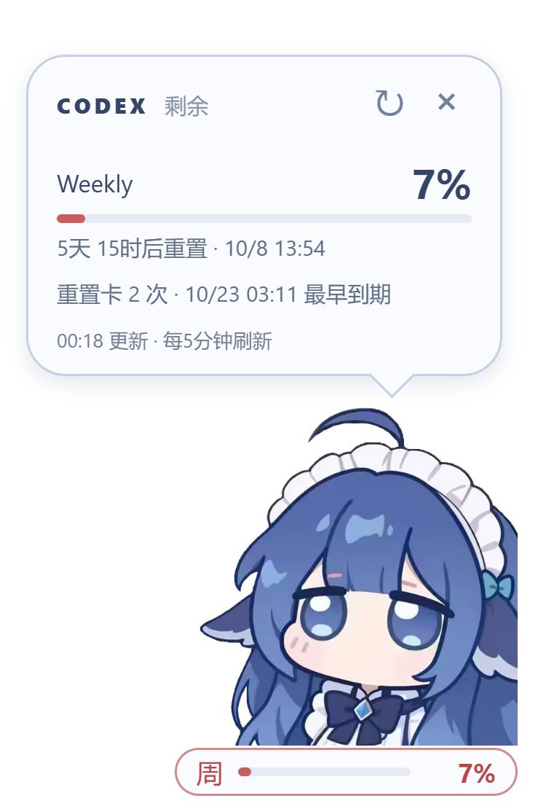

# Codex-QuotaWhale

住在 Windows 桌面的 Codex 额度小伙伴，由 **GPT-6 Astra 构建**。

  

> 本机界面预览，额度为示例。

## 下载与使用

从 [Releases](https://github.com/Easonyxz/Codex-QuotaWhale/releases) 下载 Windows 压缩包，完整解压后双击 `Codex-QuotaWhale.exe`，无需安装。

需要 Windows x64、WebView2，以及已登录 ChatGPT 账户的本机 Codex。

- **拖动鲸鱼**移动位置，重启后自动恢复。
- **鼠标悬停**查看额度和重置时间；不适用的 5h 自动隐藏。
- **右键鲸鱼或托盘图标**，可刷新、调整大小、设置开机自启动或退出。
- 气泡里的 **×** 隐藏桌宠，左击托盘图标即可找回。

## 特点

透明无边框、始终置顶，每 5 分钟自动刷新。底部常驻周额度条，剩余不超过 25% 变橙，不超过 10% 变红，不发送通知。重置卡剩余次数和到期时间显示在悬停详情中，仅启动或手动刷新时查询。

支持四档缩放、位置记忆、防重复启动和多屏位置恢复。平时收起详情，透明区域不挡鼠标。

## 灵感与致谢

- [DeepSeek-Balance-Whale-Widget](https://github.com/MeteorNOX/DeepSeek-Balance-Whale-Widget)：鲸鱼形象与桌宠交互的灵感来源。
- 图标来源：[HutaoMu](https://www.xiaohongshu.com/user/profile/5cd964cd0000000011016bf5) · [原帖](https://www.xiaohongshu.com/explore/6aaa7e160000000026019bd1)
- [quota-float](https://github.com/imwushuai-maker/quota-float)：Codex 额度读取思路的参考。

由 **GPT-6 Astra 构建**，Easonyxz 提出需求并维护。

## 说明

使用本机 Codex 登录信息读取额度，不上传登录信息到第三方服务。本项目不是 OpenAI 官方产品。

代码采用 [MIT 许可](LICENSE)。桌宠形象来源于 [DeepSeek-Balance-Whale-Widget](https://github.com/MeteorNOX/DeepSeek-Balance-Whale-Widget)，图标素材来源于 HutaoMu，素材权利归原作者。

